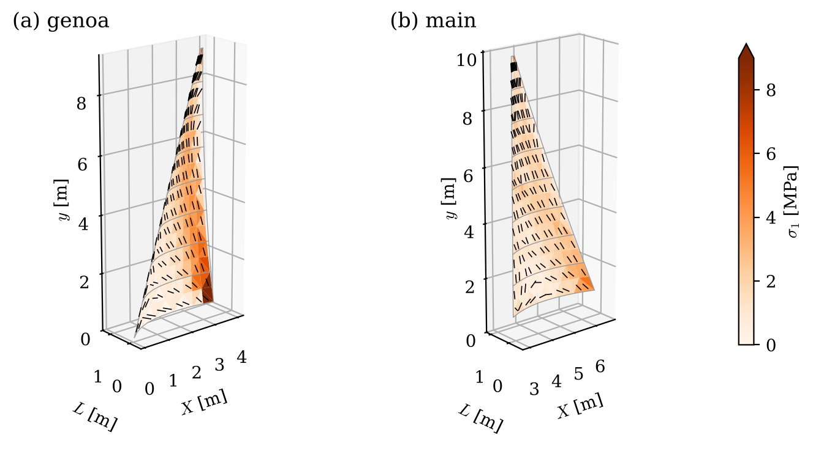

# flex-sails

A Python code computes the flying shape of a flexible sail and the loads it
carries in steady flow. The aerodynamics is a free-wake thin lifting surface,
and the sail is a geometrically nonlinear membrane that wrinkles rather than
carries compression. The two are coupled by a partitioned fixed point,
accelerated by interface quasi-Newton (IQN-ILS) iterations. The sail may have
edge cables (leech, foot and head lines), pre-tension, full-length battens and
a foot sealed on the deck. The apparent wind may vary in speed and direction
with height.

Several sails are solved together, each seeing the others' vortex systems, so
a genoa and a mainsail interact as on a boat. `sail_plan.py` runs a J/80 sail
plan upwind with rig, cloth and wind data from the literature, and plots the
deformation and the cloth stresses (docs/figures/).



The lifting surface is
[free-wake-lifting-surface](https://github.com/ignaziomviola/free-wake-lifting-surface),
vendored verbatim and checked against a manifest (docs/FLUID.md). Everything
else is written here. The structural and fluid meshes are the same grid of
nodes, so the load transfer conserves force and moment exactly.

## Requirements

Python 3 with numpy and matplotlib. The vendored solver imports pyplot at
module level, so matplotlib is required even without figures.

```bash
python3 -m pip install --user numpy matplotlib
```

## Quick start

```bash
python3 sail_fsi.py
```

The program prompts for a mainsail (luff, foot and headboard, moulded depth,
incidence, apparent wind speed and twist, cloth stiffness and pre-strain,
leech line, battens, wake model, deck), and pressing enter accepts the
defaults. It prints:
- the coupling history;
- the lift and drag coefficients of the moulded shape held rigid and of the
  flying shape;
- the centre of effort;
- the fraction of cloth that is taut, wrinkled and slack;
- the chord, depth, draft and incidence of every section.

It then plots the moulded and flying shapes. For a batch run:

```bash
printf "\n\n\n\n\n\n\n\n\n\n\n\n\n\n" | MPLBACKEND=Agg python3 sail_fsi.py
```

As a library:

```python
import sail_fluid as sf, sail_fsi as fsi

pts0 = fsi.sail_planform(luff=10.0, foot=3.5, head=0.5, nchord=8, nspan=12,
                         camber=0.08, alpha_deg=10.0)
model = fsi.build_sail(pts0, Et=5e5, prestrain=0.002, foot="pinned",
                       head="pinned", leech_EA=5e4, cable_prestrain=0.01,
                       battens=[(3, 50.0), (6, 50.0), (9, 50.0)])
onset = sf.sail_onset(u_ref=6.0, y_ref=10.0, shear=0.1, twist_deg=5.0)
res = fsi.static_aeroelastic(model, pts0, onset, u_ref=6.0)
print(res["fluid"]["CL"], fsi.flying_shape_report(res)[6])
```

For the J/80 sail plan:

```bash
MPLBACKEND=Agg python3 sail_plan.py          # ca. 2 min, writes docs/figures/
```

## Frame and units

The vendored code takes the span along y and the lift along +z, so a sail is
set up with its mast along y, the apparent wind along +x, and its leeward side
along +z. Units are SI. The air density defaults to 1.225 kg m^-3, and the
cloth enters through its membrane stiffness E t [N m^-1].

## Files

| file | content |
| --- | --- |
| `sail_membrane.py` | membrane triangles with wrinkling, cables, follower pressure, bending hinges, damped Newton solver |
| `sail_fluid.py` | the sail adapter over the vendored solver: onset, deck image, per-panel loads, lumping |
| `sail_fsi.py` | planforms, supports and battens, the coupling and its accelerators, diagnostics, the program |
| `sail_plan.py` | several sails solved together; the J/80 genoa and mainsail upwind, with figures |
| `sail_2d.py` | two-dimensional linear sail theory for an extensible membrane wing: the independent reference |
| `verify_sail.py` | the verification programme, cases S1–S5, F1 and C1–C7 |
| `test_membrane.py`, `test_sail.py`, `test_vendored.py` | unit tests (standard-library unittest) |
| `panel_wing.py`, `make_sample_inputs.py` | the vendored lifting surface, not edited here |

## Documentation

- [docs/MEMBRANE.md](docs/MEMBRANE.md): the structural formulation, the solver
  and the structural verification
- [docs/COUPLING.md](docs/COUPLING.md): the sail frame, the onset, the
  transfer, the coupling, several sails, the sail configurations, the coupled
  verification and the J/80 application
- [docs/FLUID.md](docs/FLUID.md): provenance of the vendored fluid solver

## Tests and verification

```bash
python3 test_membrane.py && python3 test_sail.py && python3 test_vendored.py
python3 verify_sail.py --quick      # S1-S5, F1, C2-C4, C7
python3 verify_sail.py              # all thirteen cases
```

## Scope

The model is steady, inviscid and attached. Separation, the mast and its wake,
the hull and the sea surface are absent. The only exception is the deck image
of a sail whose foot seals on the deck. The membrane is isotropic, and the
cloth has no bending stiffness of its own. The open items are listed in the
two documents above.

## Licence

MIT, as the vendored solver.
